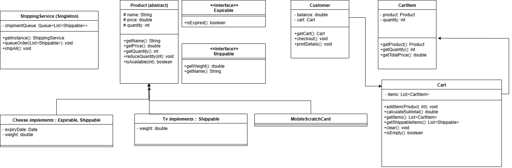

# 🛒 E-Commerce System – Design & Test Walkthrough

## 🧠 How I Think About the Design

First, I want to show you how I thought about designing this system. As engineers, we all know that designing a solution is **not less important** than writing code — and sometimes, it's even more important.

> _"Good design = easier maintenance, better scalability, and cleaner code."_

---

## 📐 UML Overview



We have a variety of products like TVs and food items, but they all share common characteristics. So, I created an **abstract class `Product`** to define those shared features, and each category (like `TV`, `Cheese`, etc.) inherits from it.

---

## 💪 Product Powers (Interfaces)

A product can have one or two additional capabilities (I like to call them “powers” 😄):

- **Expirable**: Has an expiry date.
- **Shippable**: Needs to be shipped and has a weight.

Some products have both powers, some only one, and some neither — it depends on the product type. So, I used **interfaces** to keep things flexible and clean.

---

## 🔁 Singleton: Shipping Service

For the `ShippingService`, I used the **Singleton design pattern** because we only need **one instance (our shipping team)** across the whole system. No need to create a new one every time!

---

## 👥 Core Classes

We obviously have:

- `Customer`
- `Cart`
- `CartItem`

...with proper relationships between them.

---

## 📈 Future Improvements

In the future, we can improve the system. For example, right now we duplicate the `getWeight()` method in each shippable category. Ideally, we can **move that logic up** so we don’t repeat ourselves.

---

## 🧪 Test Cases (with Output)

I was **super insistent** on testing different scenarios. Let's go through them.

---

### ✅ Customer 1: Successful Checkout

```java
Customer c1 = new Customer(700.0);
c1.getCart().addItem(freshCheese, 2);
c1.getCart().addItem(samsungTV, 1);
c1.getCart().addItem(card, 10);
c1.printDetails();
c1.checkout();
```

#### Output:

```
👤 Customer Details
Balance: $700.00

🛒 Cart Items:
- Fresh Cheese         | Qty: 2 | Unit Price: $5.00 | Total: $10.00
- Samsung TV           | Qty: 1 | Unit Price: $500.00 | Total: $500.00
- Scratch Card         | Qty: 10 | Unit Price: $2.00 | Total: $20.00

🧾 Cart Summary:
Subtotal: $530.00
Estimated Shipping: $20.00
Total Estimate: $550.00

🛒 Checkout Details:
- Fresh Cheese         | Qty: 2 | Unit Price: $5.00 | Total: $10.00
- Samsung TV           | Qty: 1 | Unit Price: $500.00 | Total: $500.00
- Scratch Card         | Qty: 10 | Unit Price: $2.00 | Total: $20.00

💳 Payment Summary:
Subtotal: $530.00
Shipping: $20.00
Total Paid: $550.00
Remaining Balance: $150.00
Added order to shipping queue.

👤 Customer Details
Balance: $150.00
Cart is empty.
```

---

### ❌ Customer 2: Expired Product

```java
Customer c2 = new Customer(300.0);
c2.getCart().addItem(expiredCheese, 1);
c2.checkout();
```

#### Output:

```
❌ C2 Checkout failed (expired product): Expired Cheese is expired
```

---

### ❌ Customer 3: Out of Stock

```java
Customer c3 = new Customer(1000.0);
c3.getCart().addItem(lgTV, 1); // lgTV quantity = 0
c3.checkout();
```

#### Output:

```
❌ C3 Checkout failed (out of stock): Not enough quantity for LG TV
```

---

### ❌ Customer 4: Insufficient Balance

```java
Customer c4 = new Customer(100.0);
c4.getCart().addItem(samsungTV, 1); // Price = $500
c4.checkout();
```

#### Output:

```
❌ C4 Checkout failed (insufficient balance)
```

### 👀 Customer 5: Views Cart Only

```java
Customer c5 = new Customer(500.0);
c5.getCart().addItem(card, 5);
c5.printDetails();
```

#### Output:

```
👤 Customer Details
Balance: $500.00

🛒 Cart Items:
- Scratch Card         | Qty: 5 | Unit Price: $2.00 | Total: $10.00

🧾 Cart Summary:
Subtotal: $10.00
Estimated Shipping: $0.00
Total Estimate: $10.00
```

---

## 🚚 Shipping All Orders

```java
ShippingService.getInstance().shipAll();
```

#### Output:

```
🚚 Shipping All Queued Orders:
Order #1
- Fresh Cheese | Weight: 1.5 KG
- Samsung TV   | Weight: 10.0 KG
✅ All orders shipped.
```

---

## 🧠 Final Thoughts

This system is designed to be:

- Clean and extensible.
- Easy to test and debug.
- Aligned with core OOP principles.
